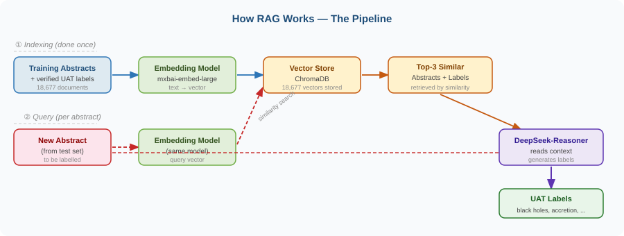
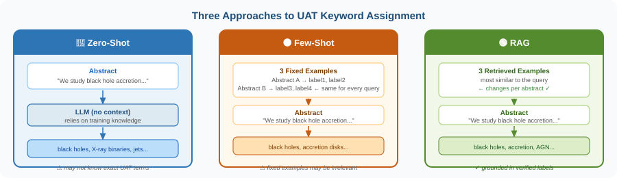
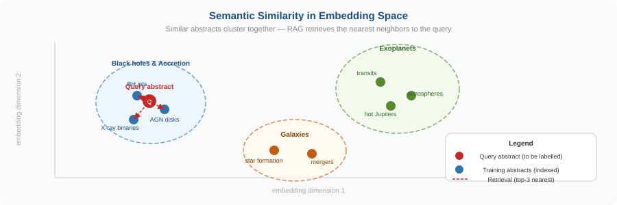

# Retrieval-Augmented Generation (RAG): A Practical Guide

### From the problem of LLM hallucination to more _reliable_ AI (illustrated with astronomical keyword assignment)

*Part of the [UAT RAG Tutorial]([../README.md](https://github.com/AtillaKaanAlkan/RAG-LanguageAI2026)) — 2026 Language AI in the Space Sciences Workshop, Baltimore, USA.*

---

Large Language Models are remarkable. They can write code, explain complex scientific concepts, translate languages, and reason through multi-step problems. But they have a well-known weakness: **they hallucinate**.

When an LLM does not know something precisely, it does not say "I don't know." It generates a confident-sounding answer anyway (one that may be plausible, grammatically correct, and completely wrong).

This is a fundamental consequence of how these models work. And it becomes a serious problem the moment you need answers that are **specific, verifiable, and grounded in a particular body of knowledge** (such as a company's internal documents, a legal database, a medical knowledge base, or a specialised scientific vocabulary).

**Retrieval-Augmented Generation (RAG)** was developed to address exactly this problem. This post explains what it is, why it works, and when you should use it (illustrated with a concrete case study from astrophysics).

---

## Why LLMs Hallucinate

To understand RAG, you first need to understand why LLMs fail at specialised tasks.

An LLM is trained by reading an enormous quantity of textbooks, websites, scientific papers, and forums, and learning to predict what word comes next. After training on hundreds of billions of words, the model has absorbed a broad, statistical picture of the world's knowledge. It knows that black holes are dense, that Shakespeare wrote Hamlet, and that Python uses indentation for code blocks.

But this knowledge is:

- **Frozen at training time**: the model knows nothing about events after its cutoff date;
- **Statistical, not factual**: it learned associations between words, not ground truth;
- **Imprecise at the edges**: common topics are well-represented; niche specialisms are not;
- **Unverifiable**: the model cannot cite where it learned something, because it learned everything simultaneously.

When you ask an LLM about something that was underrepresented in its training data (a specialised vocabulary, a private document, a recent development), it will extrapolate from what it does know and produce something that *sounds right* but may not *be right*.

This is a hallucination: confident generation in the absence of reliable knowledge.

---

## The RAG Solution: Retrieve First, Then Generate

The insight behind RAG is simple: **before generating an answer, give the model the relevant information it needs**.

Instead of relying on what the model memorised during training, you retrieve the relevant documents from an external knowledge base when the question is asked, inject them into the prompt as context, and let the model generate its answer based on that grounded context.

The model's job shifts from *"remember the answer"* to *"read this relevant material and answer based on it"*, a more reliable process.



This is the RAG pipeline in three steps:

**1. Index**: convert your knowledge base (documents, papers, records) into searchable vectors and store them in a vector database. This is done once.

**2. Retrieve**: when a query arrives, find the most semantically similar documents in the database.

**3. Generate**:  inject the retrieved documents into the prompt as context, then let the LLM generate its answer grounded in that context.

The result is an LLM that answers based on *your* knowledge base rather than on statistical associations in the training data.

---

## A Concrete Example: Assigning Astronomy Keywords to Scholarly Papers

Abstract concepts become clearer with a concrete example. Let's use one from astrophysics, a domain where specialised vocabulary makes the LLM hallucination problem particularly visible.

### The task

NASA ADS indexes hundreds of thousands of astronomical papers. Each paper needs keywords from the **Unified Astronomy Thesaurus (UAT)**,  a controlled vocabulary of over 2,000 standardised astronomy concepts. Labels like `black holes`, `accretion disks`, `transit spectroscopy`, or `chemically peculiar stars`.

A *controlled vocabulary* means only approved terms are valid. `"Black hole physics"` is not a UAT concept. `"Black holes"` is. The difference matters for search and discoverability.

Can an LLM assign these keywords automatically? Let's try three strategies.



---

### Strategy 1: Zero-Shot — Just Ask

The simplest approach: describe the task, provide the abstract, and ask the model to produce UAT labels. No examples, no context.

```
System: You are an expert astronomer. Return ONLY a comma-separated 
        list of UAT labels.

User: Assign UAT keywords to this abstract:

"The synthesis of spectral intervals in the optical range allows the
determination of LTE abundances of several iron-peak elements for the
chemically peculiar B8 Mn star HD 110073. Titanium, chromium and
manganese are found to be overabundant..."
```

**Model output:**
```
stellar abundances, chemically peculiar stars, b stars, manganese stars,
spectral synthesis, optical spectroscopy, LTE, iron peak elements,
atmospheric stratification, spectral line formation, atomic data...
```

**Ground truth (authors assigned keywords):**
```
chemically peculiar stars, mercury-manganese stars
```

The model found one correct label but generated eleven predictions. Most are astronomically reasonable, but they are not the verified UAT terms for this paper. The model over-predicts, and its vocabulary drifts from the standard.

This is the hallucination problem in action: the model knows roughly what the paper is about, but it does not know the precise UAT taxonomy, so it generates plausible-sounding alternatives.

---

### Strategy 2: Few-Shot — Show a Few Examples

A significant improvement: include a small number of solved examples directly in the prompt. Now the model can see the expected format, vocabulary, and level of specificity.

```
System: You are an expert astronomer. Return ONLY a comma-separated 
        list of UAT labels.

User: Here are 3 examples:

Abstract: [example about exoplanets]
UAT Labels: exoplanets, planetary atmospheres, transit spectroscopy

Abstract: [example about galaxies]  
UAT Labels: galaxy mergers, star formation, interstellar medium

Abstract: [example about stellar evolution]
UAT Labels: red giants, stellar nucleosynthesis, asymptotic giant branch stars

Now assign UAT labels to this abstract:
[same abstract as above]
```

**Model output:**
```
chemically peculiar stars, stellar abundances, stellar atmospheres,
spectral line identification
```

Better. The model now produces fewer, more focused predictions aligned with UAT conventions. It also found the correct `chemically peculiar stars`.

**The bottleneck:** the three examples are *fixed*. They are randomly selected once and reused for every query (regardless of relevance). A paper about solar wind gets the same examples as a paper about black holes. The model is calibrated on the wrong sub-field for most queries.

---

### Strategy 3: RAG — Retrieve the Right Examples

RAG solves the few-shot bottleneck by making the examples *dynamic*. For each new abstract, we automatically retrieve the three most similar abstracts from a database of 18,677 labeled training papers and use those as examples.

A paper about chemically peculiar stars now provides examples of chemically peculiar stars. A paper on exoplanets includes examples of exoplanets.

**Model output with RAG:**
```
chemically peculiar stars, mercury-manganese stars
```

Both correct labels, nothing extra. The model's answer is grounded in the most relevant part of the training corpus.

This is RAG working as intended: the retrieved examples are not just similar in topic — they come with verified, expert-assigned UAT labels that directly inform the model's output.

---

## The Key Ingredient: Embeddings

The retrieval step works because of a property called **semantic embeddings**.

An embedding model converts a piece of text into a list of numbers (a vector) in such a way that **texts with similar meanings produce similar vectors**. This happens even when the texts use completely different words.

A paper about *"matter infalling onto a compact object"* and a paper about *"gas accretion onto a black hole"* will have similar embeddings, because they describe the same physical phenomenon. The retrieval system can find relevant examples even with no keyword overlap.



When you visualise these vectors in two dimensions, papers naturally cluster by topic. Similar abstracts are close together. When a new query arrives, the retrieval system simply finds the nearest neighbors in this space — the papers that are geometrically closest to the query vector.

This is what makes RAG semantically aware rather than just keyword-based.

---

## How to Measure the Difference

For tasks where each item can have multiple correct labels (like UAT keyword assignment), standard accuracy does not work. We use **ranked metrics**:

- **P@k (Precision at k):** of the top-k predictions, what fraction were correct?
- **R@k (Recall at k):** of all correct labels, how many appeared in the top-k?
- **F1@k:** harmonic mean of P@k and R@k — a single balanced score

As k increases, precision falls (more predictions, more errors) and recall rises (more correct labels found). The three curves together tell you which method delivers the best quality-coverage trade-off.

In general, RAG tends to show:
- **Higher P@k at low k** — its first predictions are more reliable
- **Competitive R@k** — it still finds most correct labels
- **Better F1@k** overall, especially at intermediate k values

The advantage grows with corpus diversity. The more sub-fields your dataset spans, the more the fixed few-shot examples become irrelevant for a given query — and the more valuable dynamic retrieval becomes.

---

## RAG Beyond Astronomy

The UAT example is a particularly clean illustration of the general principle, but RAG is not specific to astronomy. The same architecture is used across many domains:

**Enterprise knowledge management** — a chatbot that answers employee questions grounded in internal policy documents, wikis, and HR guidelines. Without RAG, it would hallucinate company-specific procedures. With RAG, it retrieves the relevant policy and answers from it.

**Legal research** — a tool that retrieves relevant case law and statutes before drafting a legal analysis. The controlled vocabulary problem is identical: legal terms have precise meanings that a general LLM will approximate but not get exactly right.

**Medical assistance** — a clinical decision support tool grounded in drug databases, clinical guidelines, and diagnostic criteria. Hallucination here is not just inconvenient — it can be dangerous. RAG grounds the model in authoritative sources.

**Customer support** — a support bot that retrieves the relevant section of a product manual before answering a troubleshooting question. It does not need to have memorised the entire documentation — it retrieves what it needs, when it needs it.

In every case, the core insight is the same: **LLMs are powerful generators but unreliable memorisers of specialised knowledge. RAG separates these two concerns: a retrieval system handles knowledge lookup, and the LLM handles synthesis and generation.

---

## When to Use RAG (and When Not To)

RAG is not always the right tool. Here is a simple guide:

| Situation | Best approach |
|---|---|
| General knowledge question, no specific source needed | Zero-Shot |
| Task with a clear format, small fixed set of examples works | Few-Shot |
| Specialised vocabulary or controlled terms | RAG |
| Private or proprietary documents, the model cannot know | RAG |
| Knowledge that changes over time (post-training cutoff) | RAG |
| Need for verifiable, source-grounded answers | RAG |
| Very small knowledge base (< 50 documents) | Few-Shot is simpler |

**RAG adds the most value when your knowledge base is large, diverse, and specialised** — exactly the conditions that make fixed few-shot examples fail.

---

## Common Pitfalls

**Vector store duplication** is the most frequent bug. If you run the indexing step more than once without clearing the database, every document gets added multiple times. The retrieval system then returns duplicates, significantly degrading quality. Always check whether your collection is already populated before adding documents.

**Poor embedding model choice** matters more than most tutorials acknowledge. A general-purpose embedding model works reasonably well, but a domain-adapted model (e.g., astroBERT for astronomy) yields better semantic clusters and retrieval. The quality of retrieval sets the ceiling for RAG performance.

**Small test samples** produce noisy metrics. Evaluating on 5 or 10 examples is useful for a quick sanity check, but you need at least 50–100 examples for stable P@k and R@k values. Do not draw strong conclusions from a handful of predictions.

---

## Key Takeaways

**The problem:** LLMs hallucinate when they lack precise knowledge, especially for specialised vocabularies, private documents, or post-training information.

**The solution:** RAG connects the model to an external knowledge base at inference time. Retrieve first, then generate.

**The three strategies compared:**

- **Zero-Shot** — fast, no data needed, but drifts from controlled vocabularies
- **Few-Shot** — simple improvement, calibrates the model to your format, but the fixed examples become a bottleneck for diverse corpora
- **RAG** — dynamic retrieval makes examples always relevant; scales with more data; grounds the model in verified knowledge

**The central insight of RAG:** You do not need to fine-tune a model to give it domain knowledge. You retrieve that knowledge at inference time, inject it as context, and let the model do what it does best — synthesis and generation.

---

## Try It Yourself

#### The complete [tutorial notebook](https://github.com/AtillaKaanAlkan/RAG-LanguageAI2026) — with code for all three approaches, evaluation metrics in `uat_rag_tutorial-v2.ipynb`.
---

*Written by Atilla Alkan — Harvard-Smithsonian Center for Astrophysics / NASA Astrophysics Data System*
